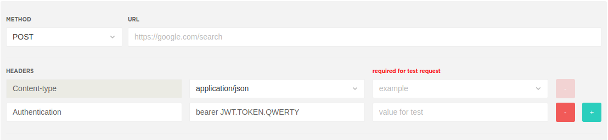
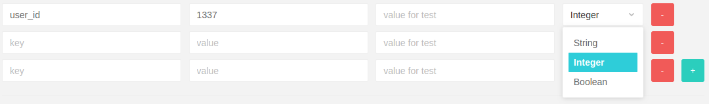
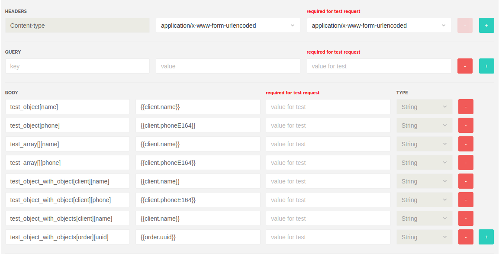
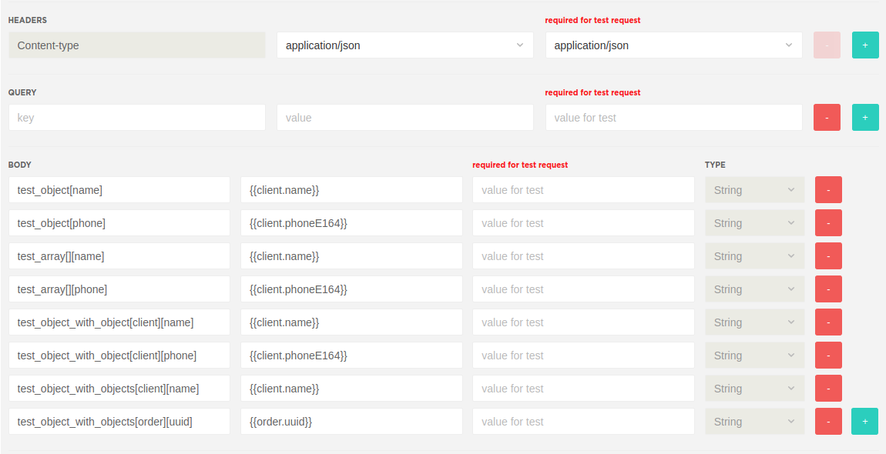
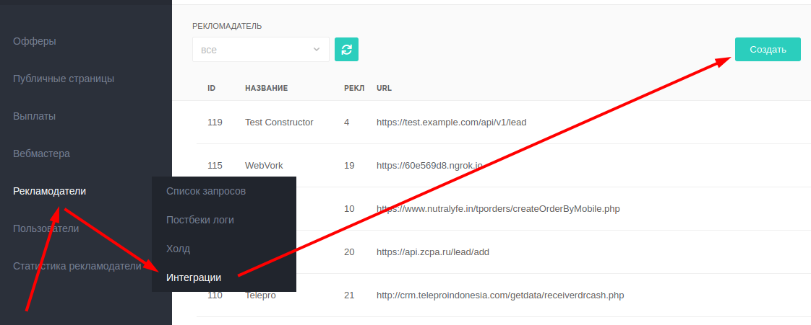
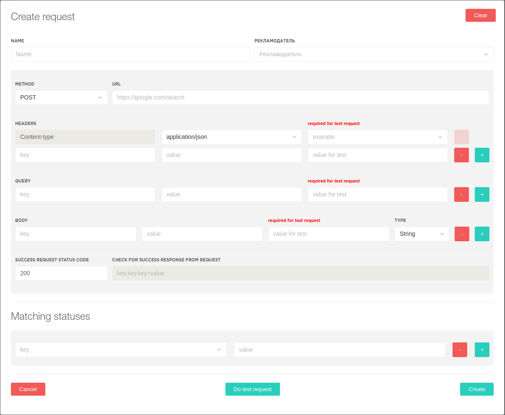
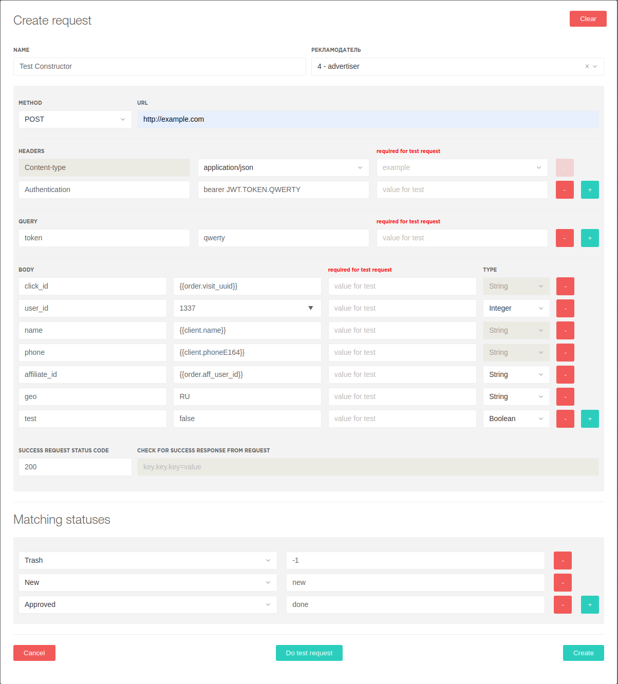
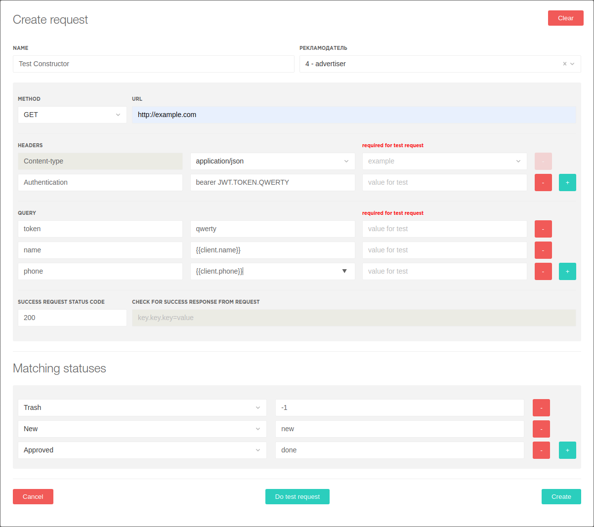

# Конструкторы

**Constructor lead send** используется для:
1. Формирования запроса к удаленному серверу.
2. Сравнения статуса рекламодателя с внутренним статусом CRM dr.сash, при работе рекламодателя через постбек.

**Constructor lead status** используется для
1. Формирования запроса для обновления статуса заказа

# ТЕОРИЯ
### Типы запросов
Оба конструктора поддерживает GET и POST запросы.

1. GET 

При передаче данных методом **GET**, передаваемые параметры задаются в адресной строке
(секция **QUERY** в конструкторе).

2. POST 

При передаче данных методом **POST**, передаваемые параметры могут быть одновременно заданы и в адресной строке (секция **QUERY** в конструкторе) и в теле запроса (секция **BODY** в конструкторе). 

И **QUERY** и **BODY** параметры являются **не обязательными**. 
И могут как полностью отсутствовать в POST запросе к конкретному рекламодателю, так и присутствовать одновременно.

## Заголовки / Headers
Для **POST** запросов обязателен **тип контента**.

Тип контента указывается в заголовке (**header**) под ключом **Content-type** \
В конструкторе возможен выбор из 2 типов контентов:
1. application/json
2. application/x-www-form-urlencoded 

Так же в заголовках при необходимости возможна передача любых иных заголовков. 

Для ключа заголовков работает автоподставка при начале ввода символов, если ключ заголовка стандартный.

Пример: передача content-type и авторизационного токена \


## Параметры запроса
Параметры могут быть переданы в Query либо в Body секции. 

### 
### Шаблоны для передаваемых параметров
Для передачи данных c автоподстановкой из CRM, используются шаблоны, шаблон указывается в двойных фигурных скобках. \
Пример: {{template}}

#### Общие шаблоны для **constructor lead send**
Для общих щаблонов работает автоподстановка
```
{{offer.hash}}        // код продукта из настроек оффера
{{order.uuid}}        // идентификатор заказа
{{order.visit_uuid}}  // идентификатор визита/клика
{{order.aff_user_id}} // идентификатор вебмастера
{{client.name}}       // имя клиента
{{client.surname}}    // фамилия клиента
{{client.phone}}      // телефон клиента
{{client.phoneE164}}  // телефон клиента в международном формате Е164 
{{client.email}}      // email клиента
{{client.geo_code}}   // двухбуквенный код страны клиента (ISO 3166-1 alpha-2)
{{client.address}}    // адрес клиента
{{client.country}}    // страна клиента
{{client.city}}       // город клиента
{{client.postcode}}   // почтовый индекс клиента
{{client.ip}}         // IP адрес клиента
```

#### Уникальные шаблоны
При очень специфических типах запросов возможно создание индивидуальных шаблонов.
#### Шаблоны для Constructor lead status
Все шаблоны для этого конструктора пока что уникальны и пишутся в коде

### Query
**Query** параметры передаются в виде дополнения к **адресной строке** (**url**)

Пример: \
Запрос на адрес
```
http://google.com
```
с установленными query параметрами:
```
name = sergey
phone = 79876543210
``` 

будет выглядеть как запрос на url
```
http://google.com?name=sergey&phone=79876543210
```

### Body
В **Body** указываются параметры передающиеся в теле **POST запроса**

Пример: \
параметры запроса:
```
token = qwerty
offer_id = 1313
name = sergey
```

#### 1. json
параметры передаются в виде **json**. 
```
{
  "token": "qwerty",
  "offer_id": 1313,
  "name": "sergey"
}
```
Для JSON особенно важно соблюдение типов данных (string, integer, boolean).


Для тех параметров которые могут быть представлены и как число и как строка в конструкторе возможен выбор типа параметра \
(например ID пользователя в системе рекламодателя)

#### 2. x-www-form-urlencoded
Этот метод по типу кодирования похож на **query**, но данные передаются в **теле запроса**, а не в **url** \
для x-www-form-urlencoded не важен тип данных (string, integer, boolean)
```
token=qwerty&offer_id=1313&name=sergey
```

#### 3. Добавление body параметров
Для передачи параметров вида "ключ"="значение" достаточно указать ключ в поле key, а значение в поле value. \
Для передачи параметров в виде отличном от "ключ"="значение" используются следующие конструкции:

##### * x-www-form-urlencoded:



```
test_object[name]=Test+Qwerty&test_object[phone]=%2B79999999999&test_array[][name]=Test+Querty&test_array[][phone]=%2B79999999999&test_object_with_object[client][name]=Test+Querty&test_object_with_object[client][phone]=%2B79999999999&test_object_with_objects[client][name]=Test+Querty&test_object_with_objects[order][uuid]=c98a0df8-9796-4f3f-8a7d-60e81a53d199
```

##### * json: 



```json
   {
     "test_array": [
       {
         "name": "Test Qwerty",
         "phone": "+79999999999"
       }
     ],
     "test_object": {
       "name": "Test Qwerty",
       "phone": "+79999999999"
     },
     "test_object_with_object": {
       "client": {
         "name": "Test Qwerty",
         "phone": "+79999999999"
       }
     },
     "test_object_with_objects": {
       "client": {
         "name": "Test Qwerty"
       },
       "order": {
         "uuid": "ab08e872-f78d-4f0c-9ebc-7ebb7ddb14eb"
       }
     }
   }
```

# Создание конструктора

Для создания нового конструктора, в правом верхнем углу открывшейся страницы необходимо нажать на кнопку
"Создать"



#### Пустая форма создания конструктора GET запроса


#### Пустая форма создания конструктора POST запроса


### Заполнение конструктора

1. ##### **NAME**
    указывается имя конструктора
2. ##### **РЕКЛАМОДАТЕЛЬ**
    выбираем рекламодателя из списка. Поддерживается поиск методом ввода **имени** или **ID** в  текстовое поле.
3. ##### **DATE PERIOD** (Constructor lead status)
    хранит данные (в часах) о том за какое время забирать данные о лидах для данного рекламодателя
4. ##### **CHUNK SIZE** (Constructor lead status)
    хранит данные о количестве лидов передаваемых рекламодателю в одном запросе
5. ##### **METHOD**
    выбираем необходимый **метод для http запроса** из списка **GET** или **POST**
6. ##### **URL**
    указывается полный **url** рекламодателя вместе со схемой (*http/https*), доменом (*example.com / dr.cash / google.com*), и дополнительными, не изменными параметрами. 
    Так же может укзываться ip адрес и порт рекламодателя, если публичного доменного имени у него нет
   
    Примеры:
    ```
    http://google.com 
    https://example.com/api/v1/lead 
    https://api.example.com/send 
    http://192.168.0.1:1234/leads
   ```

7. ##### **HEADERS**
    Первой строкой идет заголовок определяющий метод кодирования тела запроса. \
    Выбор представлен полями **application/json** и **application/x-www-form-urlencoded** \
    Дополнительные необходимые заголовки можно добавлять в следующие строки, а
    дополнительные строки добавляются нажатием на зеленую кнопку с **+** 

8. ##### **QUERY**    
    В данной секции указываются query поля 

9. ##### **BODY**
    Данная секция активна только для POST запроса

10. ##### **SUCCESS REQUEST STATUS CODE**
    Указывается **код** ответа **от** рекламодателя на корректный запрос

11. ##### **LEAD ID** (Constructor lead send)
    Для тех рекламодателей которые отдают внешний идентификатор лида для дальнейших запросов статуса лида. \
    Указывается как в коде ответа найти идентификатор лида. \
    По образцу из [gjson](https://github.com/tidwall/gjson)

12. ##### *LEAD AND STATUS MATCHING* (Constructor lead status)
    Указывается ключевая строка для сопоставления лида и статуса лида в ответе рекламодателя. \
    По образцу из [gjson](https://github.com/tidwall/gjson)

13. ##### **Matching statuses**
    Устанавливается соответствие статусов рекламодателей к нашим статусам \
    Статусы не являются обязательными, но если статус не будет найден, то входящий постбек от рекламодателя будет помечен как ошибочный.

### Пример для Constructor lead send

POST



равноценно curl запросу
```
    curl -X POST \
      'http://example.com?token=qwerty' \
      -H 'Authorization: Bearer JWT.TOKEN.QWERTY' \
      -H 'Content-Type: application/json' \
      -d '{
    	"click_id": "test uuid",
    	"user_id": 1337,
    	"name": "Test Qwerty",
    	"phone": "+79999999999",
    	"affiliate_id": "1",
    	"geo": "RU",
    	"test": false
    }'
```
GET



равноценно cURL запросу
```
curl -X GET \
  'http://example.com?token=qwerty&name=Test%20Qwerty&phone=+79999999999' \
  -H 'Authorization: Bearer JWT.TOKEN.QWERTY' \
  -H 'Content-Type: application/json' \
```