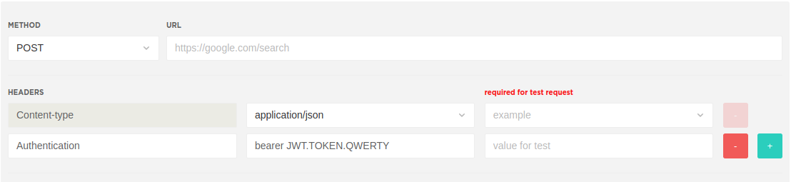
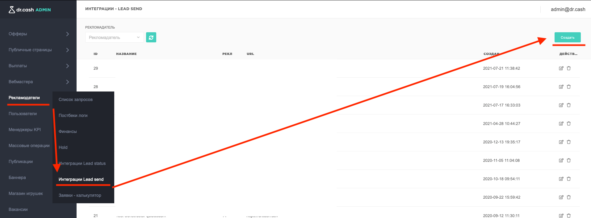
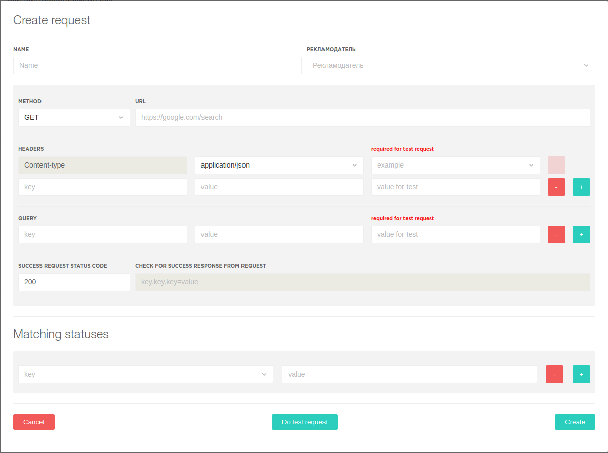
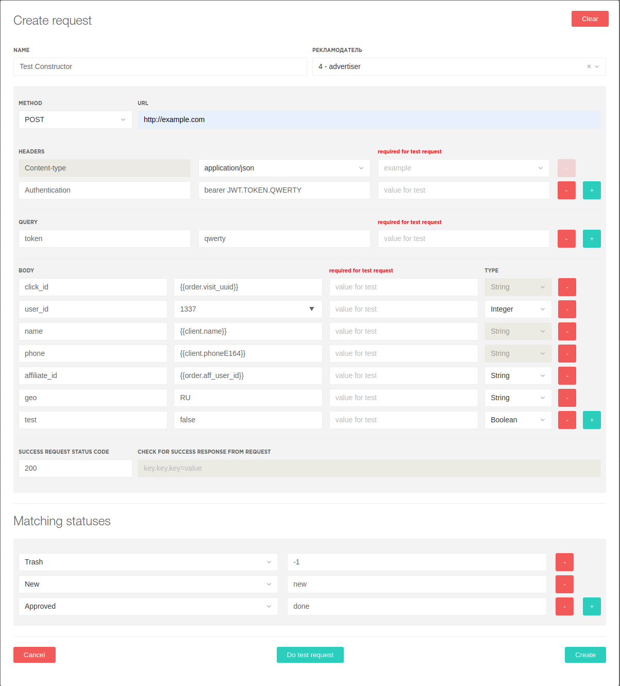

#Конструктор

Конструктор создан для указания параметров формирующих
1. Запрос для передачи рекламодателям информации о заказах и проверки ответа на этот запрос
2. Сравнения статуса результатов обработки заказов рекламодателем

Сперва размере, что такое http запрос

#ТЕОРИЯ
### Типы запросов
Обязательно соответствие типа запроса указанному типу запросов рекламодателя.

1. GET 

При передаче данных методом **GET**, передаваемые параметры задаются в адресной строке 
(секция **QUERY** в конструкторе).
2. POST 

При передаче данных методом **POST**, передаваемые параметры могут быть 
одновременно заданы и в адресной строке (секция **QUERY** в конструкторе). 
И в теле запроса (секция **BODY** в конструкторе). 
И **QUERY** и **BODY** параметры являются **не обязательными**. 
И могут как полностью отсутствовать в POST запросе к конкретному рекламодателю, так и присутствовать одновременно.

## Заголовки / Headers
Для **POST** запросов обязателен **тип запроса**.

Тип запроса указывается в заголовке (**header**) с названием **Content-type** \
В конструкторе возможен выбор из 2 типов запросов:
1. application/json
2. application/x-www-form-urlencoded 

Так же в заголовках возможна передача аутентификационных JWT токенов \
Пример: \
Authentication: bearer JWT.TOKEN.QWERTY \


Возможны и иные обязательные заголовки для конкретного рекламодателя. \
Для заголовков работает автоподставка ключа при вводе символа, если ключ заголовка стандартный.

## Параметры запроса
Параметры могут быть переданы в Query либо в Body секции.

### Шаблоны для передаваемых параметров
Для передачи данных c автоподстановкой из CRM, используются шаблоны, шаблон указывается в двойных фигурных скобках. \
Пример: {{template}}

#### Общие шаблоны
Для общих щаблонов работает автоподстановка
```
{{offer.hash}}
{{offer.price}}
{{order.uuid}}
{{order.visit_uuid}}
{{order.aff_user_id}}
{{client.name}}
{{client.surname}}
{{client.phone}}
{{client.phoneE164}}
{{client.email}}
{{client.geo_code}}
{{client.address}}
{{client.country}}
{{client.city}}
{{client.postcode}}
{{client.ip}}
```

#### Уникальные шаблоны для конкретных рекламодателей
```
{{magic.hygeia.code}}
{{admade.geocode}}
{{lucky.online.goals}}
{{nutralyfe.additional.attributes}}
{{everad.ip}}
```

### Query
**Query** параметры передаются в виде дополнения к **адресной строке** (**url**)

Пример: \
Запрос на адрес
```
http://google.com
```
с установленными query параметрами:
```
name=sergey
phone=79876543210
``` 

будет выглядеть как запрос на url
```
http://google.com?name=sergey&phone=79876543210
```

### Body
В **Body** указываются параметры передающиеся в теле **POST запроса**

Пример: \
параметры запроса:
```
token = qwerty
offer_id = 1313
name = sergey
```

#### 1. json
параметры передаются в виде **json**. 
```
{
  "token": "qwerty",
  "offer_id": 1313,
  "name": "sergey"
}
```
Для JSON особенно важно соблюдение типов данных (string, integer, boolean).


Для тех параметров которые могут быть представленны и как число и как строка в конструкторе возможен выбор типа параметра \
(например ID пользователя в системе рекламодателя)

#### 2. x-www-form-urlencoded
Этот метод по типу кодирования похож на **query**, но данные передаются в **теле запроса**, а не в **url** \
для x-www-form-urlencoded не важен тип данных (string, integer, boolean)
```
token=qwerty&offer_id=1313&name=sergey
```

# Создание конструктора

Для создания нового конструктора, в правом верхнем углу открышейся страницы необходимо нажать на кнопку
"Создать"



#### Пустая форма создания конструктора GET запроса


#### Пустая форма создания конструктора POST запроса


### Заполнение конструктора

1. ##### **NAME**
    указывается имя конструктора
2. ##### **РЕКЛАМОДАТЕЛЬ**
    выбираем рекламодателя из списка. Поддерживается поиск методом ввода **имени** или **ID** в  текстовое поле.
3. ##### **METHOD**
    выбираем необходимый **метод для http запроса** из списка **GET** или **POST**
4. ##### **URL**
    указывается полный **url** рекламодателя вместе со схемой (*http/https*), доменом (*example.com / dr.cash / google.com*), и дополнительными, не изменными параметрами. 
    Так же может укзываться ip адрес и порт рекламодателя, если публичного доменного имени у него нет
   
    Примеры:
    ```
    http://google.com 
    https://example.com/api/v1/lead 
    https://api.example.com/send 
    http://192.168.0.1:1234/leads
   ```

5. ##### **HEADERS**
    Первой строкой идет заголовок опреледяющий метод кодирования тела запроса. \
    Выбор представлен полями **application/json** и **application/x-www-form-urlencoded** \
    Дополнительные необходимые заголовки можно добавлять в следующие строки, а
    дополнительные строки добавляются нажатием на зеленую кнопку с **+** 

6. ##### **QUERY**    
    В данной секции указываются query поля 

7. ##### **BODY**
    Данная секция появляется только после

8. ##### **SUCCESS REQUEST STATUS CODE**
    Указывается **код** ответа **от** рекламодателя на корректный запрос

9. ##### **CHECK FOR SUCCESS RESPONSE FROM REQUEST** (отключено)
    Указывается корректный **body** ответа **от** рекламодателя на корректный запрос

10. ##### **Matching statuses**
    Устанавливается соответствие статусов рекламодателей к нашим статусам \
    Статусы не являются обязательными, но если статус не будет найден, то входящией постбек от рекламодателя будет помечен как ошибочный.

### Пример

